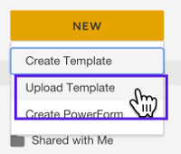
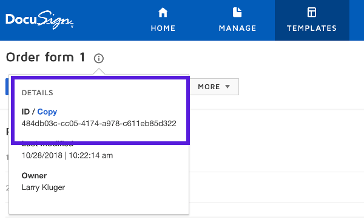

# Installation Instructions

Requirements: C# and .NET Core 2.1 or later.

This repository has been tested as a Visual Studio 2017
Community Edition solution.

### Short installation instructions
* Download or clone this repository.
* The repository includes a Visual Studio 2017 solution file and
  NuGet package references in the project file.
* Configure the project by editing the existing project file
  `common/App.config`

  See the Configuration section, below, for more information.
* The solution's Main class is in `common/Program.cs`

## Configure a DocuSign Payments account
This example enables the purchaser to pay for their order as
part of the DocuSign Signing Ceremony. To enable payments, first
add a payment account to your DocuSign account.

DocuSign offers built-in connections to multiple payment
gateways. This example uses a demo account via the Stripe
gateway service.

1. Login to demo.docusign.net and go to the Admin Tool.
1. On the Integrations / Payments screen, click Stripe.
1. For development, you can skip the Stripe account application
   by using the `Skip this account form` link:

   
1. Next, the Admin Tool will show that an enabled Stripe
   payment gateway account has been associated with your
   DocuSign Developer account.

## Install the DocuSign Template
This code example sends an envelope using a DocuSign Template.
To install the template:

1. First add a payment gateway to your account as shown above.
1. Login to your DocuSign Developer account.
1. Do **not** go to the Admin Tool. Instead, click `Templates`
   at the top of the screen.
1. In the **My Templates** screen, click the `New` icon and
   choose the `Upload Template` option:

   

   Upload the `Installation\Orderform1_template.json` file
   from this repository.
1. The new template `Order form 1` will be created in your account.
   The template will be automatically updated to use your
   account's payment gateway.
1. Click the template's name to see its screen.
1. On the template's screen, click the information glyph
   
   by the
   template's name. The template's details will be shown.

   Copy the template's ID. You will need it when you configure
   the code example:

   

## Configure the example

Configure the example via the `common/App.config` file.
An example config file is included: 
[`common/App.config_example.txt`](https://github.com/docusign/blog-csharp-order-form/blob/master/common/App.config_example.txt)

**Recommendation:** add `common/App.config` to your `.gitignore` file so your
private information will not be added to your repository.

Do not store your Integration Key, private key, or other
private information in your code repository.

### The Template ID
Set the `DS_TEMPLATE_ID` value to the template ID you previously
recorded when you added the template to your account.

### Creating the Integration Key
Your DocuSign Integration Key must be configured for a JWT OAuth authentication flow:
* Using the DocuSign Admin tool,
  create a public/private key pair for the integration key.
  Store the private key
  in a secure location. You can use a file or a key vault.
* The example requires the private key. Store the private key in the
  `App.config` file.
* If you will be using individual consent grants, you must create a
  `Redirect URI` for the key. Any URL can be used. By default, this
  example uses `https://www.docusign.com`

### The impersonated user's guid
The JWT will impersonate a user within your account. The user can be
an individual or a user representing a group such as "HR".

The example needs the guid assigned to the user.

The guid value for each user in your account is available from
the DocuSign Admin tool in the **Users** section.
To see a user's guid, **Edit** the user's information.
On the **Edit User** screen, the guid for the user is shown as
the `API Username`.
